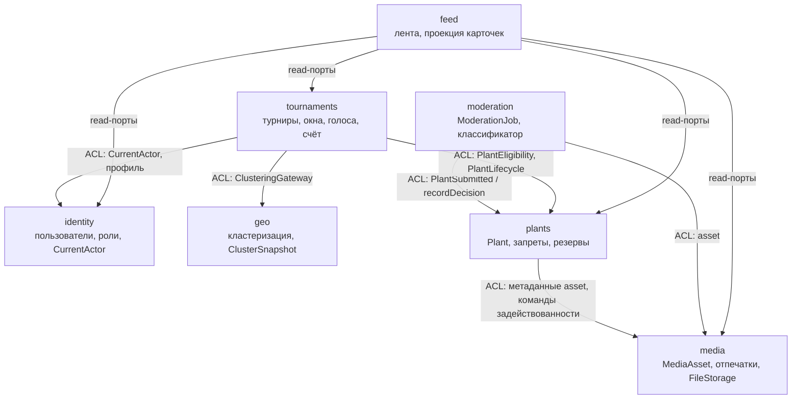

# Context Map — границы bounded contexts

Источник: `docs/requirements.md`, разделы 4.2–4.3. Направления зависимостей
проверяются ArchUnit-тестом `ContextBoundaryTest` (включая отдельное правило на
каждое запрещённое направление).

## Диаграмма контекстов (направления зависимостей)

## Допустимые зависимости (раздел 4.3 требований)

| Контекст | Может обращаться к `api` контекстов | Тип отношения |
|---|---|---|
| identity | — | Upstream для всех; Open Host Service (CurrentActor, публичный профиль) |
| media | — | Upstream для plants, moderation, feed |
| geo | — | Upstream для tournaments; получает координаты во входной команде, сам identity не читает |
| plants | media | Customer–Supplier; ACL над `MediaAsset`, команды задействованности `MediaAssetClaims` (ADR-008) |
| moderation | plants, media | Downstream: подписан на `PlantSubmitted`, отдаёт решение командой в plants.api |
| tournaments | identity, plants, geo | Downstream; ACL `PlantEligibility`, `ParticipantDirectory`, `ClusteringGateway` |
| feed | tournaments, plants, media, identity | Downstream, только чтение через read-порты |

Правило: контекст использует **только пакет `api`** другого контекста и только
из своих адаптеров (`adapter.out.<ctx>` / `adapter.in.events`). `domain` и
`application` контекста не импортируют другие контексты вообще.

## Правила, устраняющие циклы (дословно из требований)

- plants не знает о moderation и tournaments. Когда создан `Plant`, plants
  публикует событие `PlantSubmitted`; moderation создаёт задание, подписавшись
  на него. Решение moderation передаёт командой `plants.api.PlantModeration.recordDecision(...)`.
- plants публикует `PlantModerationDecided` (APPROVED/REJECTED); tournaments
  подписан на него и переводит заявку (READY / возврат в INVITED).
- tournaments сообщает о гибели командой `plants.api.PlantLifecycle.registerDeath(...)`,
  а не записью в таблицы plants.
- Потребитель владеет своим портом (Consumer-driven): например,
  `tournaments.application.port.out.PlantEligibility` с собственными типами
  ответа; адаптер `tournaments.adapter.out.plants.InProcessPlantEligibility`
  вызывает `plants.api` и переводит его DTO в модель tournaments (ACL).
  В лабе №2 меняется только этот адаптер.
- plants сообщает media о задействованности и публичности файла командами
  `media.api.MediaAssetClaims.claim/release`; media хранит задействованность,
  но не знает о растениях (ADR-008) — plantId это ключ команды, не ссылка.

## Таблица взаимодействий

| Инициатор | Получатель | Взаимодействие | Тип | Синхронность | Лаба №2 | Лаба №4 |
|---|---|---|---|---|---|---|
| plants | media | метаданные `MediaAsset` по assetId | запрос через `media.api` | синхронно | Feign | Feign |
| plants | media | `MediaAssetClaims.claim/release` (задействованность, публичность) | команда | синхронно, в транзакции подачи/архивации | Feign + компенсация | Kafka-команды |
| moderation | plants | подписка на `PlantSubmitted` | событие | in-process | идемпотентная HTTP-команда + retry | Kafka `plant.moderation.v1` |
| moderation | plants | `PlantModeration.recordDecision` | команда | синхронно | HTTP-команда | Kafka |
| moderation | media | метаданные asset для инференса | запрос через `media.api` | синхронно | Feign | Feign |
| tournaments | identity | `CurrentActor`, публичный профиль | запрос | синхронно | Feign | Feign |
| tournaments | plants | `PlantEligibility.reserveSubmission/confirmEligibility` | команда/запрос | синхронно | Feign + saga | Kafka-команды |
| tournaments | plants | `PlantLifecycle.registerDeath` | команда | синхронно, в транзакции закрытия окна | saga-команда | Kafka `plant.lifecycle.v1` |
| tournaments | geo | `ClusteringGateway` (состав эпохи) | команда/запрос | синхронно | Feign/R2DBC | Feign |
| feed | tournaments | проекция карточек по событиям | события | in-process | события внутри tournament-service | Kafka → проекция |
| feed | plants | публичные данные растения | запрос через `plants.api` | синхронно | Feign | Feign |
| feed | media | URL изображения по assetId | запрос через `media.api` | синхронно | Feign | Feign |
| feed | identity | минимальные публичные сведения о владельце | запрос через `identity.api` | синхронно | Feign | Feign |

## Способ выполнения обязательных последствий (раздел 10.3)

- Одобрение модерации → перевод заявки в READY: синхронно в той же транзакции
  координирующим use case применения решения модерации.
- Гибель растений при закрытии окна: синхронно в той же транзакции закрытия окна
  через команды `plants.api`.
- `@TransactionalEventListener(AFTER_COMMIT)` и `@Async` — только для
  необязательных побочных эффектов (уведомления, журнал), никогда для инвариантов.
