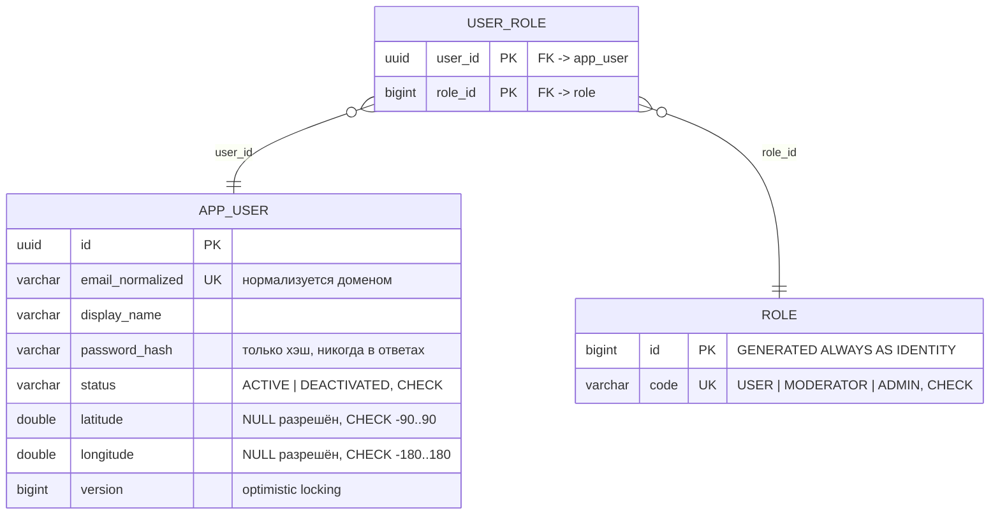
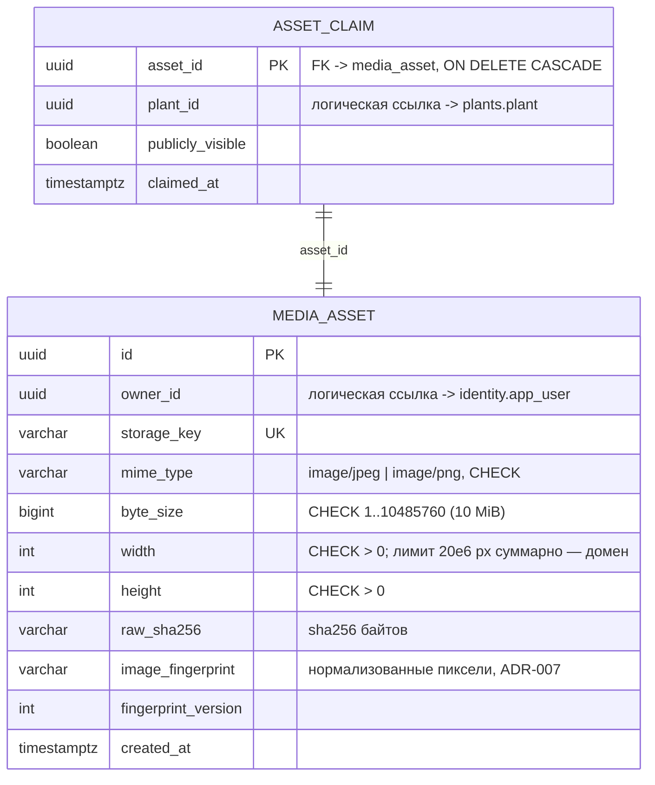
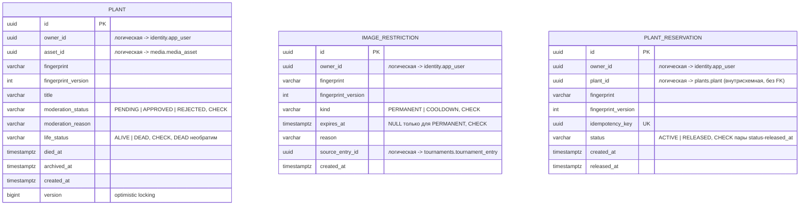
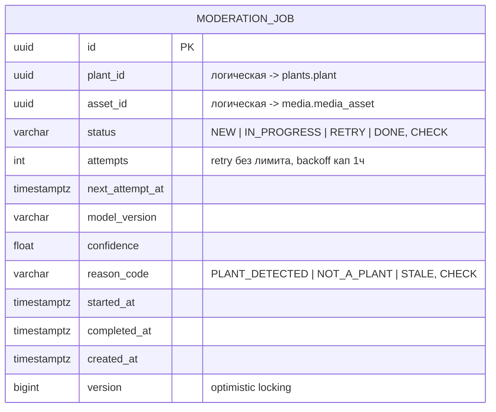
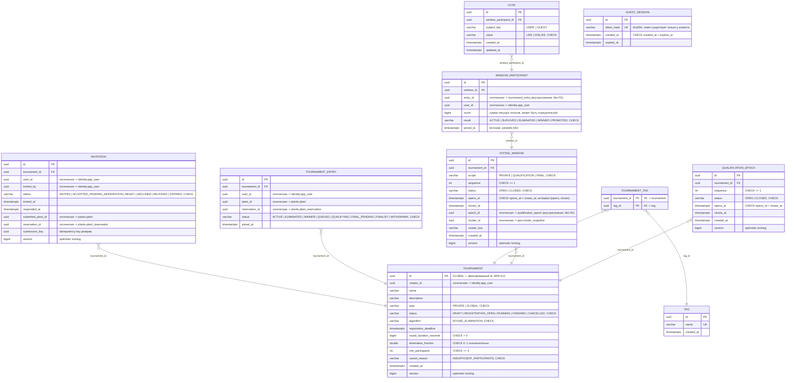
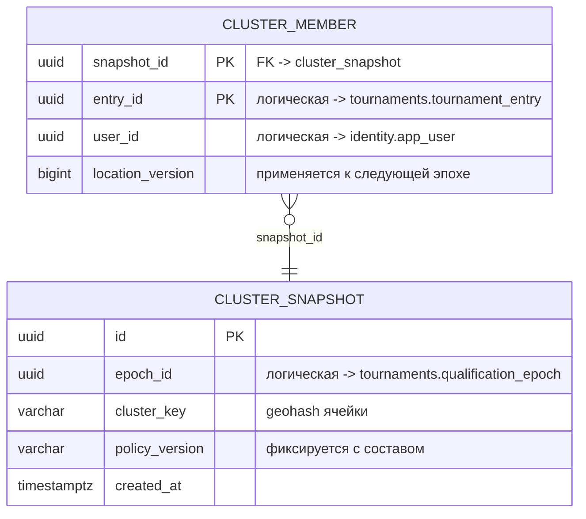
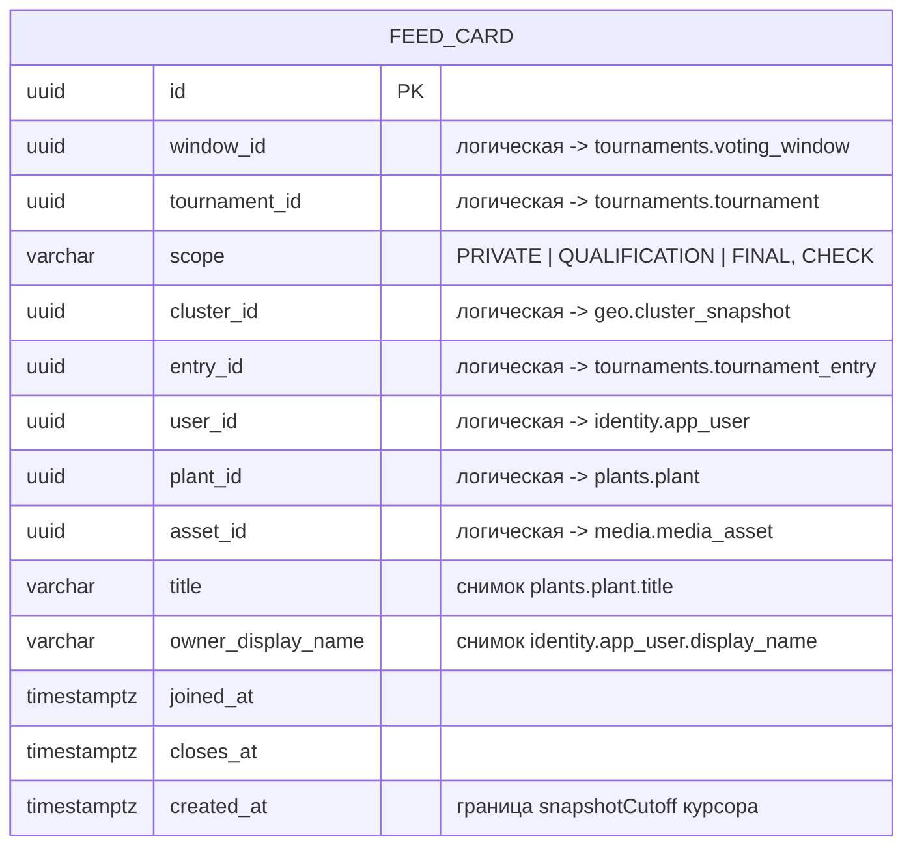

# ER-диаграмма (схемы по контекстам)

Источник истины — миграции Flyway `src/main/resources/db/migration/<context>/`.
Одна PostgreSQL, отдельная схема на контекст (раздел 11 требований).
**Межсхемных FK нет** — ссылки между контекстами логические (UUID), ссылочная
целостность проверяется use cases: компромисс ради выделения сервисов в лабе №2
(перенос схемы = перенос каталога миграций без изменений). Все enum — VARCHAR +
CHECK; время — `timestamptz` (UTC); ID — UUID.

## identity

Many-to-Many без дополнительных полей: `app_user ↔ role` через `user_role`
(PK по двум FK). Справочник `role` засеян миграцией.

## media

`asset_claim` — задействованность файла растением (ADR-008): один файл — одно
растение (PK по `asset_id`); media хранит, plants командует через
`MediaAssetClaims` (иначе цикл зависимостей). Индексы: `(owner_id, created_at)`,
`(image_fingerprint)`.

## plants

Физических FK в схеме нет (границы контекстов, раздел 10.4). Частичные
уникальные индексы (set-инварианты, проверяются БД):

- `plant_active_asset_uidx ON plant(asset_id) WHERE archived_at IS NULL` —
  один файл — одно неархивированное растение (ADR-008);
- `plant_reservation_active_pair_uidx ON plant_reservation(owner_id, fingerprint)
  WHERE status = 'ACTIVE'` — не более одного активного резерва на пару
  (допущение 4);
- `image_restriction(owner_id, fingerprint)` — обычный индекс, история запретов
  append-only;
- `plant(owner_id, created_at)` — обычный индекс, выборка растений владельца.

## moderation

Частичный индекс due-опроса: `moderation_job_due_idx ON moderation_job(
next_attempt_at) WHERE status IN ('NEW','RETRY')`. Обычный индекс
`(plant_id, created_at)` — последнее задание по заявке (идемпотентность
слушателя). Ошибка распознавателя — не решение (RETRY), устаревший результат —
STALE.

## tournaments

Физические связи внутри схемы (раздел 11): One-to-Many `tournament →
invitation/entry/voting_window/qualification_epoch`; Many-to-Many с
дополнительными полями `voting_window ↔ tournament_entry` через
`window_participant` (score, result, joined_at); Many-to-Many без полей
`tournament ↔ tag`.

Частичные уникальные индексы (инварианты конкурентности):

- `invitation_pair_uidx (tournament_id, user_id)` — один invite на
  пользователя/турнир (полный UNIQUE);
- `tournament_entry_pair_uidx (tournament_id, user_id) WHERE status IN
  ('ACTIVE','ELIMINATED','WINNER')` — один entry пользователя в private-турнире;
- `tournament_entry_one_active_global_uidx (user_id) WHERE tournament_id =
  <GLOBAL-id> AND status IN ('QUEUED','QUALIFYING','FINAL_PENDING','FINALIST')`
  — одно активное глобальное участие (допущение 5);
- `voting_window_private_seq_uidx / _final_seq_uidx (tournament_id, sequence)
  WHERE scope = ...` и `voting_window_qualification_cell_uidx (epoch_id,
  cluster_id) WHERE scope = 'QUALIFICATION'` — последовательности окон;
- `voting_window_one_open_private_uidx / _one_open_final_uidx (tournament_id)
  WHERE status = 'OPEN' AND scope = ...` — одно открытое окно на турнир и scope;
- `qualification_epoch_seq_uidx (tournament_id, sequence)` — полный UNIQUE,
  последовательность эпох;
- `qualification_epoch_one_open_uidx (tournament_id) WHERE status = 'OPEN'`;
- `window_participant_pair_uidx (window_id, entry_id)` — один участник на
  окно/entry; `vote_subject_uidx (window_participant_id, subject_key)` — один
  голос субъекта за участника окна (допущение 7).

Служебные индексы выборок: `tournament(status, registration_deadline)`,
`tournament(creator_id)`, `invitation(user_id, status)`,
`invitation(tournament_id, status)`, `invitation(submitted_plant_id, status)`,
`tournament_entry(tournament_id, status)`, `voting_window(status, closes_at)`,
`voting_window(scope, status, closes_at)`, `window_participant(window_id,
score DESC)`, `vote(window_participant_id)`, `guest_session(expires_at)`.

## geo

Состав и версия политики неизменны после фиксации эпохи (снимок, не живой
кластер). Индекс `cluster_snapshot(epoch_id)` — снимки эпохи.

## feed

Read-модель (ADR-002): без агрегата, обновляется событиями
`VotingWindowOpened`/`VotingWindowClosed`, `UNIQUE(window_id, entry_id)`.
Псевдослучайный порядок — `hashtextextended(id::text, :seed)` в SQL, не колонка.
Индексы `feed_card(closes_at)` и `feed_card(created_at)` — выборка закрытий и
курсор.

## Логические межсхемные ссылки (без FK)

| Схема | Колонка | Цель (схема.таблица) |
|---|---|---|
| media | `media_asset.owner_id` | identity.app_user |
| media | `asset_claim.plant_id` | plants.plant |
| plants | `plant.owner_id`, `plant.asset_id` | identity.app_user, media.media_asset |
| plants | `image_restriction.source_entry_id` | tournaments.tournament_entry |
| plants | `plant_reservation.plant_id` | plants.plant (внутрисхемная, без FK) |
| moderation | `moderation_job.plant_id`, `.asset_id` | plants.plant, media.media_asset |
| tournaments | `tournament.creator_id`, `invitation.user_id/invited_by`, `tournament_entry.user_id`, `window_participant.user_id` | identity.app_user |
| tournaments | `invitation.submitted_plant_id/reservation_id`, `tournament_entry.plant_id/reservation_id` | plants.plant, plants.plant_reservation |
| tournaments | `voting_window.epoch_id`, `voting_window.cluster_id/cluster_key` | tournaments.qualification_epoch, geo.cluster_snapshot |
| tournaments | `window_participant.entry_id` | tournaments.tournament_entry (внутрисхемная, без FK) |
| geo | `cluster_snapshot.epoch_id` | tournaments.qualification_epoch |
| geo | `cluster_member.user_id`, `.entry_id` | identity.app_user, tournaments.tournament_entry |
| feed | `feed_card.window_id/tournament_id/entry_id`, `.plant_id`, `.asset_id`, `.user_id`, `.cluster_id` | tournaments.*, plants.plant, media.media_asset, identity.app_user, geo.cluster_snapshot |
