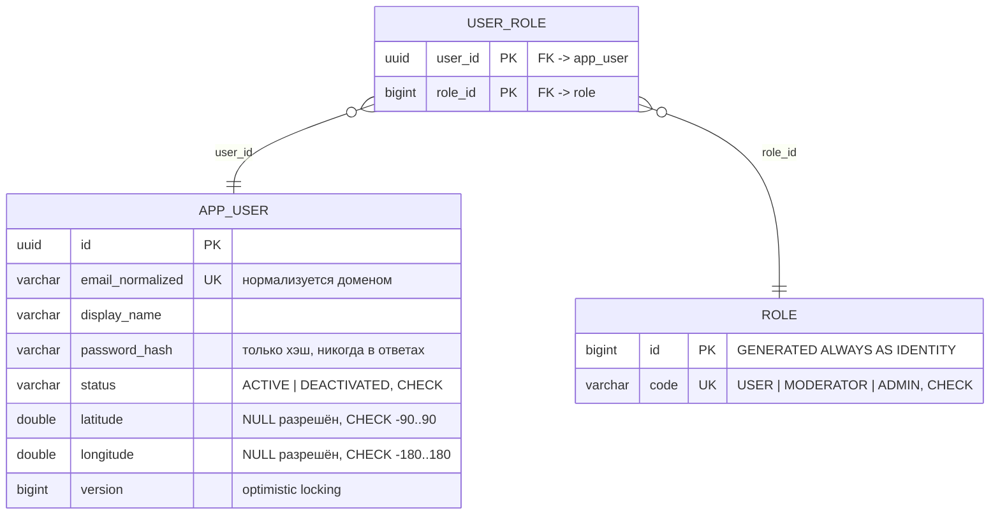
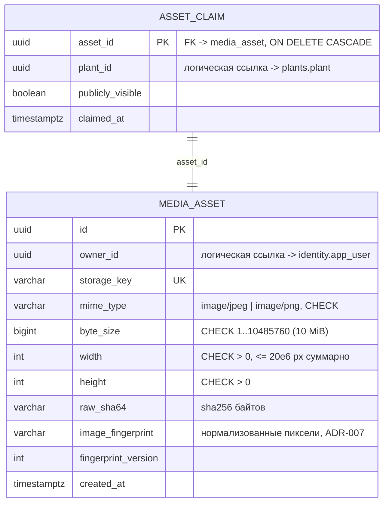
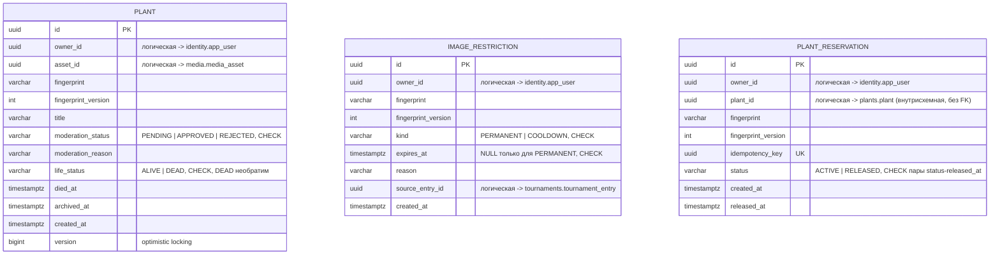
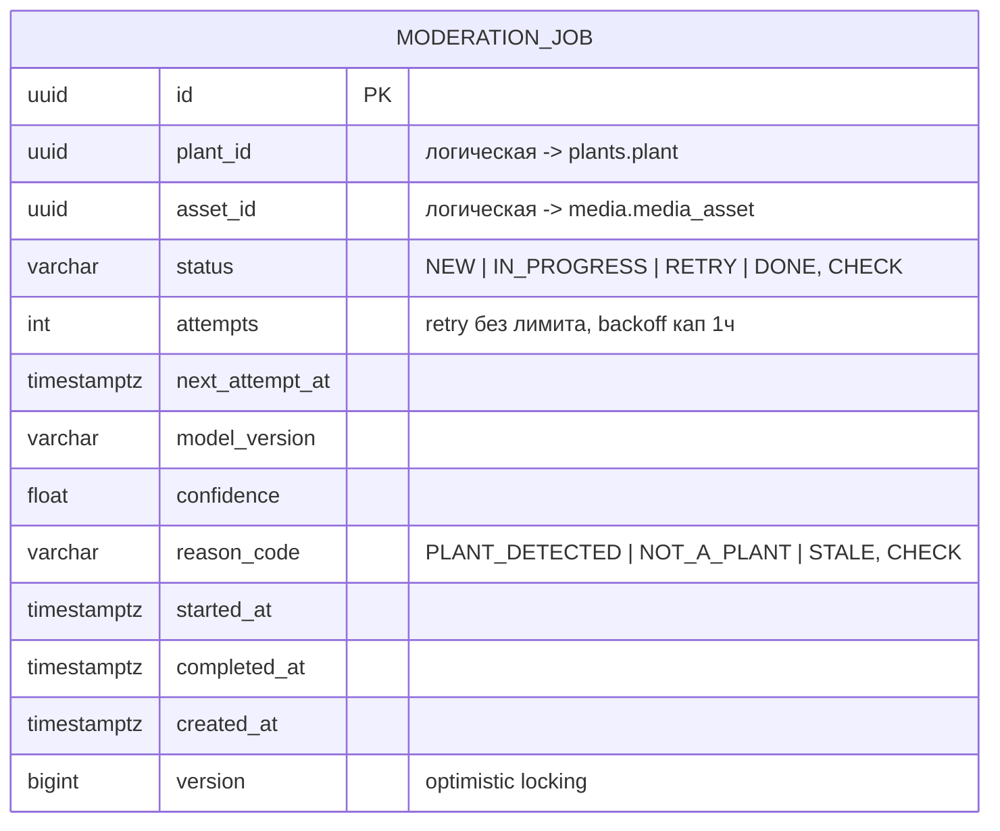
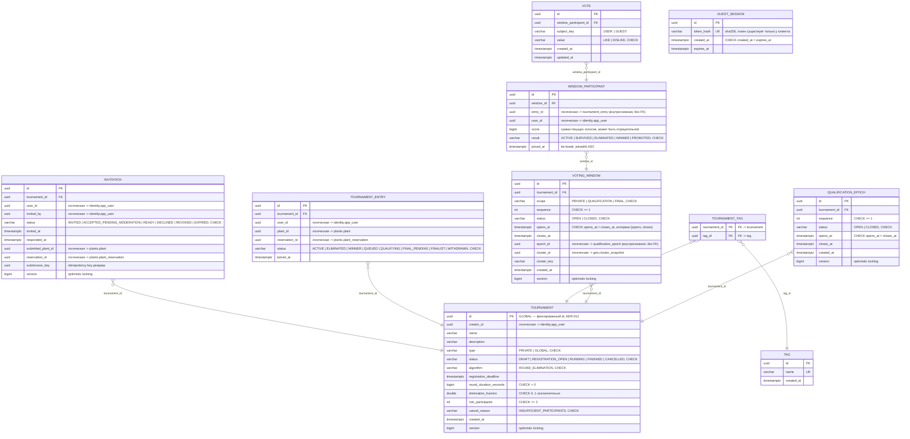
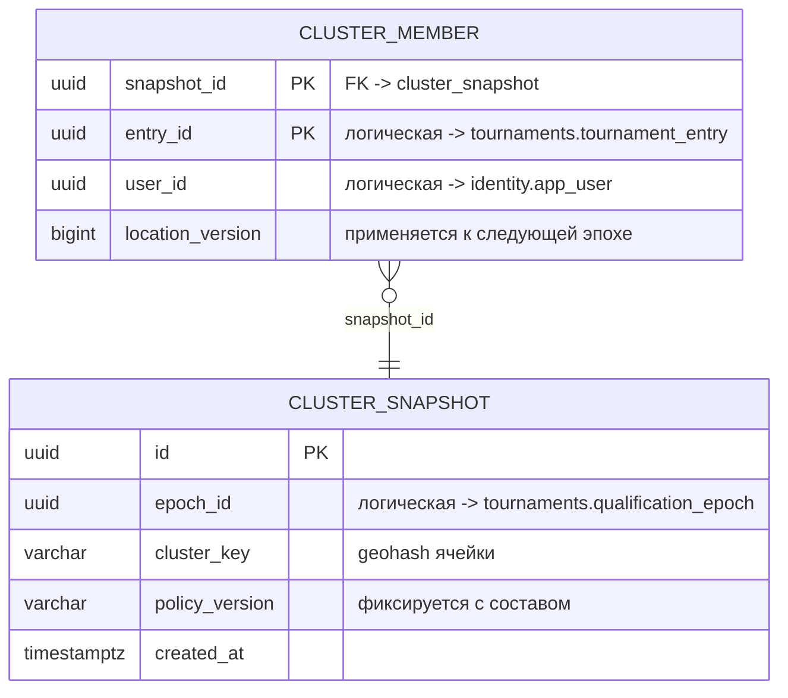
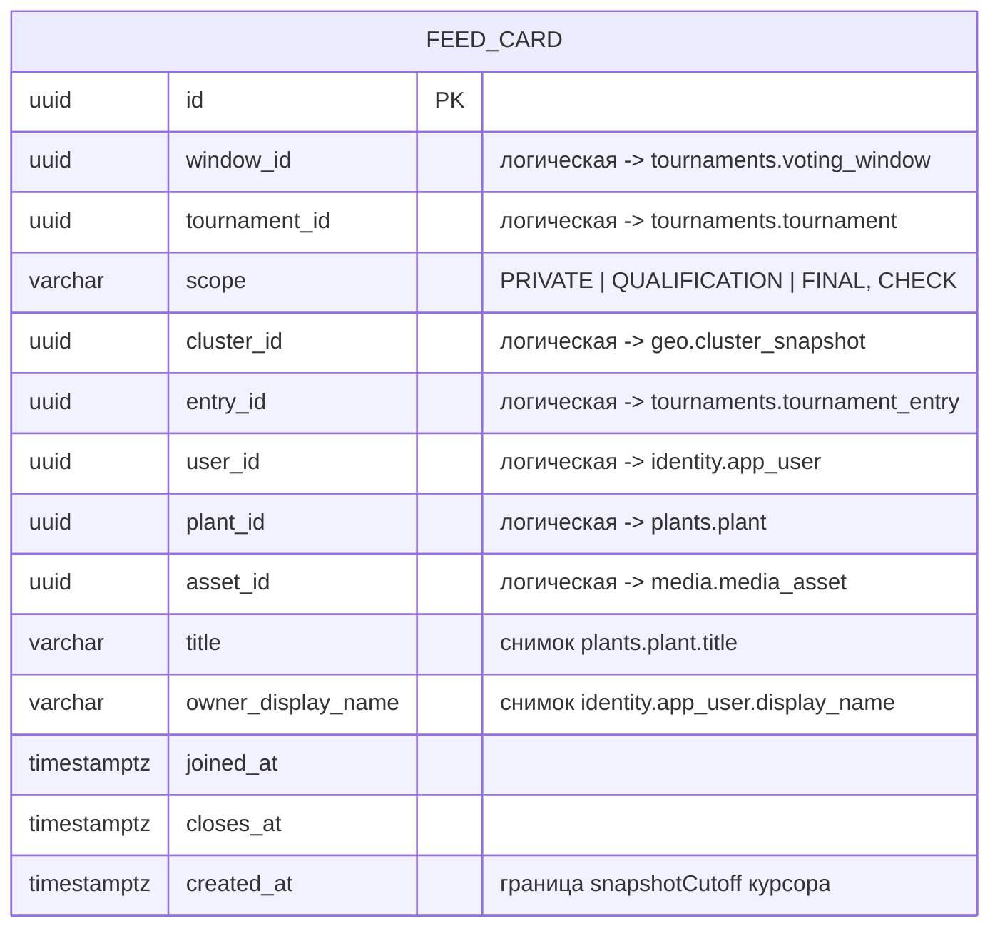

# Итерация 9 (готовность) — Implementation Plan

> **For agentic workers:** REQUIRED SUB-SKILL: Use superpowers:subagent-driven-development (recommended) or superpowers:executing-plans to implement this plan task-by-task. Steps use checkbox (`- [ ]`) syntax for tracking.

**Goal:** Закрыть все критерии готовности лабы №1 (раздел 17 требований): ER-диаграмма со схемами по контекстам, Swagger-сценарии по порядку демо, аудит «допущение/инвариант → именованный тест», точечный рефакторинг-аудит, финальная верификация (`./mvnw verify` с gate, `-P inference`, `docker compose up --build` из чистого состояния + smoke).

**Architecture:** Итерация не добавляет функциональность. Новые файлы — только документация (`docs/domain/er-diagram.md`, `docs/demo/scenarios.md`) и, при найденных пробелах аудита, тесты. Продакшен-код меняется только точечными `refactor:`-правками без смены поведения. Дизайн: `docs/specs/2026-10-04-iteration-9-readiness-design.md`.

**Tech Stack:** Без изменений: Java 21, Spring Boot 4.0.8, PostgreSQL 17.5, Flyway, Testcontainers, JaCoCo 0.8.15, ArchUnit 1.5.0, Mermaid (документация). Новых зависимостей нет.

## Global Constraints

- Ветка `feat/iteration-9-readiness` (от `main`); Conventional Commits; красные тесты в `main` не попадают.
- Коммиты, меняющие `src/main` или `src/test`, — только после зелёного `./mvnw verify`; коммиты только docs (`docs/`, `README.md`) — verify не требуют.
- Миграции, REST-контракты, доменная модель — без изменений. Переименования публичных контрактов и разбиение агрегатов запрещены (риск регрессии в финальной итерации).
- ER-диаграмма — снимок миграций `src/main/resources/db/migration/<context>/`; при расхождении правится диаграмма (миграции — источник истины, они не меняются).
- Среда: macOS/zsh; рабочая директория `lab1-monolith/`; scratch-файлы диагностики не коммитировать; Docker-контейнеры после smoke-проверки останавливать (`docker compose down`).
- Push и merge в удалённый `main` — только по отдельной команде пользователя; локальный merge в `main` — Task 6.

## Карта файлов итерации

```text
docs/domain/er-diagram.md                                           НОВОЕ (Task 1)
docs/demo/scenarios.md                                              НОВОЕ (Task 2)
README.md                                                           ИЗМЕНЕНО (Task 2: раздел «Демо-сценарии»)
docs/domain/aggregates.md                                           ИЗМЕНЕНО (Task 3: таблица «допущение → тест»)
src/test/java/...                                                   ТОЛЬКО при пробелах Task 3
src/main/java/..., src/test/java/...                                ТОЛЬКО точечные refactor-правки Task 4
docs/plans/2026-09-23-roadmap.md                                    ИЗМЕНЕНО (Task 6: отметка выполнения)
```

---

### Task 1: ER-диаграмма со схемами по контекстам

**Files:**
- Create: `docs/domain/er-diagram.md`

**Interfaces:**
- Consumes: миграции `src/main/resources/db/migration/{identity,media,plants,moderation,tournaments,geo,feed}/*.sql` (источник истины, прочитаны при составлении плана).
- Produces: `docs/domain/er-diagram.md` — критерий раздела 17 «ER-диаграмма со схемами по контекстам»; на Task 2–6 не влияет (чистая документация).

- [ ] **Step 1: Ветка**

```bash
git checkout main && git pull --ff-only 2>/dev/null; git checkout -b feat/iteration-9-readiness
```

- [ ] **Step 2: Создать `docs/domain/er-diagram.md`**

Полное содержимое (7 диаграмм — по одной на схему-контекст, физические FK только внутри схемы, логические межсхемные ссылки — отдельной таблицей; типы упрощены до читаемых, точные ограничения — в комментариях и списках под диаграммой):

````markdown
# ER-диаграмма (схемы по контекстам)

Источник истины — миграции Flyway `src/main/resources/db/migration/<context>/`.
Одна PostgreSQL, отдельная схема на контекст (раздел 11 требований).
**Межсхемных FK нет** — ссылки между контекстами логические (UUID), ссылочная
целостность проверяется use cases: компромисс ради выделения сервисов в лабе №2
(перенос схемы = перенос каталога миграций без изменений). Все enum — VARCHAR +
CHECK; время — `timestamptz` (UTC); ID — UUID.

## identity



Many-to-Many без дополнительных полей: `app_user ↔ role` через `user_role`
(PK по двум FK). Справочник `role` засеян миграцией.

## media



`asset_claim` — задействованность файла растением (ADR-008): один файл — одно
растение (PK по `asset_id`); media хранит, plants командует через
`MediaAssetClaims` (иначе цикл зависимостей). Индексы: `(owner_id, created_at)`,
`(image_fingerprint)`.

## plants



Физических FK в схеме нет (границы контекстов, раздел 10.4). Частичные
уникальные индексы (set-инварианты, проверяются БД):

- `plant_active_asset_uidx ON plant(asset_id) WHERE archived_at IS NULL` —
  один файл — одно неархивированное растение (ADR-008);
- `plant_reservation_active_pair_uidx ON plant_reservation(owner_id, fingerprint)
  WHERE status = 'ACTIVE'` — не более одного активного резерва на пару
  (допущение 4);
- `image_restriction(owner_id, fingerprint)` — обычный индекс, история запретов
  append-only.

## moderation



Частичный индекс due-опроса: `moderation_job_due_idx ON moderation_job(
next_attempt_at) WHERE status IN ('NEW','RETRY')`. Ошибка распознавателя — не
решение (RETRY), устаревший результат — STALE.

## tournaments



Физические связи внутри схемы (раздел 11): One-to-Many `tournament →
invitation/entry/voting_window/qualification_epoch`; Many-to-Many с
дополнительными полями `voting_window ↔ tournament_entry` через
`window_participant` (score, result, joined_at); Many-to-Many без полей
`tournament ↔ tag`.

Частичные уникальные индексы (инварианты конкурентности):

- `invitation_pair_uidx (tournament_id, user_id)` — один invite на
  пользователя/турнир (полный UNIQUE);
- `tournament_entry_pair_uidx (tournament_id, user_id) WHERE status IN
  ('ACTIVE','ELIMINATED','WINNER')` — один entry пользователя в private-турнире;
- `tournament_entry_one_active_global_uidx (user_id) WHERE tournament_id =
  <GLOBAL-id> AND status IN ('QUEUED','QUALIFYING','FINAL_PENDING','FINALIST')`
  — одно активное глобальное участие (допущение 5);
- `voting_window_private_seq_uidx / _final_seq_uidx (tournament_id, sequence)
  WHERE scope = ...` и `voting_window_qualification_cell_uidx (epoch_id,
  cluster_id) WHERE scope = 'QUALIFICATION'` — последовательности окон;
- `voting_window_one_open_private_uidx / _one_open_final_uidx (tournament_id)
  WHERE status = 'OPEN' AND scope = ...` — одно открытое окно на турнир и scope;
- `qualification_epoch_one_open_uidx (tournament_id) WHERE status = 'OPEN'`;
- `window_participant_pair_uidx (window_id, entry_id)` — один участник на
  окно/entry; `vote_subject_uidx (window_participant_id, subject_key)` — один
  голос субъекта за участника окна (допущение 7).

## geo



Состав и версия политики неизменны после фиксации эпохи (снимок, не живой
кластер).

## feed



Read-модель (ADR-002): без агрегата, обновляется событиями
`VotingWindowOpened`/`VotingWindowClosed`, `UNIQUE(window_id, entry_id)`.
Псевдослучайный порядок — `hashtextextended(id::text, :seed)` в SQL, не колонка.

## Логические межсхемные ссылки (без FK)

| Схема | Колонка | Цель (схема.таблица) |
|---|---|---|
| media | `media_asset.owner_id` | identity.app_user |
| media | `asset_claim.plant_id` | plants.plant |
| plants | `plant.owner_id`, `plant.asset_id` | identity.app_user, media.media_asset |
| plants | `image_restriction.source_entry_id` | tournaments.tournament_entry |
| plants | `plant_reservation.plant_id` | plants.plant (внутрисхемная, без FK) |
| moderation | `moderation_job.plant_id`, `.asset_id` | plants.plant, media.media_asset |
| tournaments | `tournament.creator_id`, `invitation.user_id/invited_by`, `tournament_entry.user_id`, `window_participant.user_id` | identity.app_user |
| tournaments | `invitation.submitted_plant_id/reservation_id`, `tournament_entry.plant_id/reservation_id` | plants.plant, plants.plant_reservation |
| tournaments | `voting_window.epoch_id`, `voting_window.cluster_id/cluster_key` | tournaments.qualification_epoch, geo.cluster_snapshot |
| tournaments | `window_participant.entry_id` | tournaments.tournament_entry (внутрисхемная, без FK) |
| geo | `cluster_snapshot.epoch_id` | tournaments.qualification_epoch |
| geo | `cluster_member.user_id`, `.entry_id` | identity.app_user, tournaments.tournament_entry |
| feed | `feed_card.window_id/tournament_id/entry_id`, `.plant_id`, `.asset_id`, `.user_id`, `.cluster_id` | tournaments.*, plants.plant, media.media_asset, identity.app_user, geo.cluster_snapshot |
````

- [ ] **Step 3: Проверить рендер и соответствие миграциям**

Самопроверка содержимого против миграций (каждая таблица/индекс/CHECK из
`src/main/resources/db/migration/**/*.sql` отражена; типы упрощены намеренно —
точные VARCHAR-длины в миграциях). Визуальная проверка mermaid-блоков: открыть
файл в IDE/GitHub-превью — все 7 диаграмм рендерятся без ошибок синтаксиса.

- [ ] **Step 4: Commit**

```bash
git add docs/domain/er-diagram.md
git commit -m "docs(er): ER-диаграмма со схемами по контекстам (раздел 17)"
```

---

### Task 2: Swagger-сценарии демо + ссылка из README

**Files:**
- Create: `docs/demo/scenarios.md`
- Modify: `README.md` (раздел «Демо-сценарии» после «Запуск»)

**Interfaces:**
- Consumes: REST-контракты итераций 1–8 (раздел 13 требований), `README.md` (структура разделов), demo-ручка `POST /api/v1/internal/demo/jobs/run-due`.
- Produces: `docs/demo/scenarios.md` — критерий «все сценарии выполнимы через Swagger UI» + «порядок сценариев» (раздел 13); используется Task 5 (smoke-прогон первых шагов).

- [ ] **Step 1: Создать `docs/demo/scenarios.md`**

Полное содержимое:

````markdown
# Демо-сценарии через Swagger UI

Порядок демонстрации всех сценариев лабы №1 (раздел 13 требований).
Swagger UI: http://localhost:8080/swagger-ui/index.html.

Идентификация (ADR-005): заголовок `X-Demo-User-Id: <UUID>` (профиль `dev`).
Отсутствие заголовка — гость; роли всегда из БД. Гостевое голосование —
заголовок `X-Guest-Token: <token>` (см. сценарий 8). Дедлайны не ждём:
`POST /api/v1/internal/demo/jobs/run-due` (M/A) продвигает наступившие
дедлайны через те же use cases, что и scheduler.

## 0. Запуск и вход

1. `docker compose up --build` — app + PostgreSQL, миграции применяются
   автоматически, healthcheck: http://localhost:8080/actuator/health.
2. Bootstrap-админ создаётся из ENV (`BOOTSTRAP_ADMIN_EMAIL`/`_PASSWORD`,
   см. `.env.example`); повторный запуск дубль не создаёт.
3. ID админа для `X-Demo-User-Id` (отдельной ручки нет — сознательно,
   лаба №3 добавит JWT-логин):

```bash
docker compose exec postgres psql -U postgres -d plantarena -t -A -c \
  "select id from identity.app_user where email_normalized = 'admin@plantarena.local'"
```

## 1. identity — пользователи и роли

1. `POST /api/v1/users` (X-Demo-User-Id: админ): `{"email":"alice@example.com",
   "password":"password-9","displayName":"Alice"}` → 201, `id` — запомнить.
   Модератор создаёт только USER; ролей в DTO нет.
2. `GET /api/v1/me` (X-Demo-User-Id: alice) → 200 профиль без passwordHash.
3. `PUT /api/v1/me/location` (alice): `{"latitude":55.7558,"longitude":37.6173}`
   → 200. Координаты нужны для глобального турнира (сценарий 7).
4. `PUT /api/v1/users/{bobId}/roles/moderator` (админ) → 200, идемпотентно;
   `DELETE .../roles/moderator` → 204 (снять, не удаляя USER).
5. Негативные: `GET /api/v1/users` без заголовка → 401; `PATCH /users/{id}` с
   `roles` в теле → 400 (произвольные роли запрещены).

## 2. media — загрузка изображений

1. `POST /api/v1/files` (alice, multipart `file`, JPEG/PNG ≤ 10 MiB) → 201:
   `assetId`, метаданные (MIME по фактическому содержимому), без путей хранилища.
2. Негативные: текстовый файл с расширением .png → 415; > 10 MiB → 413;
   без заголовка → 401.
3. `GET /api/v1/files/{assetId}` — владелец всегда; чужим файл доступен только
   через одобренное растение (сценарий 4), иначе 404.

## 3. plants — подача заявки

1. `POST /api/v1/plants` (alice): `{"assetId":"...","title":"Мой фикус"}` →
   201, `PENDING`/`ALIVE`; файл задействован (повторное растение на тот же
   файл → 409 `ASSET_IN_USE`).
2. `GET /api/v1/plants/{id}/moderation` (alice) → статус, причина,
   `retryUploadAllowed`.
3. `PATCH /api/v1/plants/{id}` (alice) — только `title`; `DELETE` — архивация
   вне активного резерва (в сценарии 5–7 даст 409 `PLANT_UNDER_RESERVATION`).

## 4. Модерация — автоматическое распознавание

1. После `POST /plants` публикуется `PlantSubmitted`, задание обрабатывается
   автоматически (scheduler 2с). Для демо: `POST /api/v1/internal/demo/jobs/
   run-due` (админ) → `processed`.
2. `GET /api/v1/plants/{id}/moderation` (alice): фото растения → `APPROVED`
   (`PLANT_DETECTED`); фото без растения → `REJECTED` (`NOT_A_PLANT`).
3. Отклонение — не гибель и не запрет: повторная загрузка (новый файл →
   новый `POST /plants`) — новая заявка с новым ID.
4. Настоящий ONNX-инференс (MobileNetV2): `./mvnw verify -P inference` —
   эталонные ромашка/собака (ADR-009).

## 5. Закрытый турнир — от черновика до старта

1. `POST /api/v1/tags` (модератор/админ): `{"name":"succulents"}` → 201.
2. `POST /api/v1/tournaments` (модератор): name, `registrationDeadline`
   (например `+2 мин`), `roundDurationSeconds: 30`, `eliminationFraction:
   0.5`, `minParticipants: 2`, `tagIds` → 201 DRAFT.
3. `POST /api/v1/tournaments/{id}/open-registration` → 200.
4. `POST /api/v1/tournaments/{id}/invitations` (organizer): `{"userId":
   "<aliceId>"}` → 201; дубль → 409. Пригласить 2+ пользователей.
5. Каждый приглашённый: `GET /api/v1/me/invitations` → свой invite;
   `POST /api/v1/invitations/{id}/accept` c `{"plantId":"<APPROVED-растение>"}` →
   200 `READY` (резерв изображения: повторное использование той же картинки в
   другом турнире → 409 `IMAGE_RESTRICTED`/конфликт резерва).
6. `POST /api/v1/tournaments/{id}/start` до дедлайна → 409; после —
   `run-due` (или scheduler) стартует: `GET /api/v1/tournaments/{id}` →
   `RUNNING`, `GET .../entries` — участия ACTIVE.
7. Отмена при нехватке: турнир с 1 READY после дедлайна → CANCELLED
   `INSUFFICIENT_PARTICIPANTS`, резервы освобождены, растения живы.

## 6. Голосование и раунды

1. `GET /api/v1/feed` (участник) → карточки окна; или `GET /api/v1/tournaments/
   {id}/rounds`, `.../leaderboard?windowId=...`.
2. `PUT /api/v1/windows/{windowId}/entries/{entryId}/vote` (участник bob за
   растение alice): `{"value":"LIKE"}` → 200 `score: 1`; повтор LIKE → 1;
   `DISLIKE` → −1 (дельта −2); `DELETE .../vote` → 204, счёт 0;
   `GET .../my-vote` → текущий голос.
3. Самоголосование alice за себя → 403 (допущение 6). Голос постороннего →
   404 (турнир скрыт). Голос после `closesAt` → 409 `VOTING_CLOSED`.
4. Закрытие раунда: `run-due` после closesAt → выбывший: растение DEAD
   (`GET /api/v1/plants/{id}`), изображение запрещено навсегда (повторная
   подача той же картинки → 409 `IMAGE_RESTRICTED` без retryAt), запись в
   `.../results`. Выживший → следующий раунд со счётом 0; единственный —
   WINNER, турнир FINISHED, резерв победителя освобождён.
5. Выбывший участник продолжает голосовать до FINISHED (допущение 9).

## 7. Глобальный турнир — гео-отбор и финал

1. Участники: `PUT /me/location` (разные ячейки geohash для разных кластеров,
   например Москва/СПб), APPROVED-растение → `POST /api/v1/global/entries` →
   201 QUEUED (резерв; вторая заявка того же пользователя → 409).
2. `GET /api/v1/global` — конфигурация и текущие окна (публично);
   `GET /api/v1/global/clusters` — кластеры текущей эпохи.
3. `run-due` после `epoch-duration`: открыта эпоха, квалификационные окна по
   кластерам. `GET /api/v1/global/clusters/{id}/leaderboard` — отбор кластера;
   `GET /api/v1/global/leaderboard?scope=FINAL` — финал (scope, windowId,
   closesAt, asOf).
4. Закрытие квалификации: top-1 кластера → финал (PROMOTED), остальные —
   гибель + COOLDOWN 24 ч на совпавшую картинку (409 с `retryAt`), новое
   участие другим изображением сразу разрешено (допущение 5).
5. Финал: из n ≥ 2 выбывает max(1, floor(n/2)) худших; единственный лидер
   остаётся; новых финалистов включает следующее окно. GLOBAL никогда не
   FINISHED (ADR-012).
6. `GET /api/v1/me/global-entry` — своё участие; `DELETE /api/v1/global/
   entries/{id}` — снятие из очереди (только QUEUED, иначе 409).

## 8. Лента и гостевые сессии

1. `POST /api/v1/guest-sessions` (без заголовков, публично) → 201
   `{"token","expiresAt"}` — токен показывается один раз; > 10/мин с одного
   IP → 429 + `Retry-After`.
2. `GET /api/v1/feed` (X-Guest-Token) → только глобальные карточки
   `{items,nextCursor,hasNext}` без total; `limit=2` → `hasNext: true`,
   пройти курсором до конца — страницы не пересекаются.
3. `PUT /api/v1/windows/{globalWindowId}/entries/{entryId}/vote`
   (X-Guest-Token) → 200; закрытое окно гостю → 404; без токена → 401;
   > 30/мин → 429.
4. `GET /api/v1/feed` (X-Demo-User-Id) — смешение: глобальные + закрытые
   турниры, где пользователь допущен к старту; оценённые субъектом карточки
   не предлагаются.
5. Негативные курсоры: `cursor=garbage` → 400 `FEED_CURSOR_INVALID`; курсор
   другого субъекта → 400; истёкший (TTL 1 ч) → 410 `FEED_CURSOR_EXPIRED`.
````

- [ ] **Step 2: Добавить раздел в `README.md`**

После раздела «Запуск» (строка ~18, перед «Демо-идентификация») вставить:

```markdown
## Демо-сценарии

Пошаговый порядок демонстрации всех сценариев через Swagger UI:
[`docs/demo/scenarios.md`](docs/demo/scenarios.md) — от запуска и
bootstrap-админа до ленты и гостевых сессий.
```

- [ ] **Step 3: Проверить ссылки и факты**

Сверить каждый шаг сценария с фактическими REST-контрактами: пути, коды
ответов, названия ошибок (`ASSET_IN_USE`, `IMAGE_RESTRICTED`,
`PLANT_UNDER_RESERVATION`, `VOTING_CLOSED`, `FEED_CURSOR_INVALID`,
`FEED_CURSOR_EXPIRED`, `RATE_LIMITED`) — grep по `src/main/java/.../adapter/in/web`
и существующим IT-тестам (источник: `FeedApiIT`, `TournamentsApiIT`,
`GlobalApiIT`, `VotingApiIT`, `MediaApiIT`, `PlantsApiIT`, `IdentityApiIT`).
Расхождение — править сценарий, не код.

- [ ] **Step 4: Commit**

```bash
git add docs/demo/scenarios.md README.md
git commit -m "docs(demo): Swagger-сценарии по порядку демо + ссылка из README"
```

---

### Task 3: Аудит «допущение/инвариант → именованный тест»

**Files:**
- Modify: `docs/domain/aggregates.md` (новый раздел «Допущения раздела 3 → защищающие тесты»)
- Test (только при пробелах): соответствующие `*Test`/`*IT` в `src/test/java/com/plantarena/<context>/`

**Interfaces:**
- Consumes: раздел 3 `docs/requirements.md` (допущения 1–10), `docs/domain/aggregates.md` (таблица инвариантов с колонкой «защищающий тест»), существующие тесты `src/test`.
- Produces: полная таблица соответствия в `aggregates.md` — критерий раздела 17 «каждое допущение из раздела 3 и каждый инвариант покрыт именованным тестом».

- [ ] **Step 1: Проверить существующее покрытие допущений 1–10**

Ожидаемое соответствие (составлено по фактическому коду; проверить наличие
каждого теста и его `@DisplayName`):

| # | Допущение (раздел 3) | Защищающий тест |
|---|---|---|
| 1 | Гибель относится к экземпляру; DEAD необратим; повторная загрузка — новый экземпляр | `PlantTest` (переходы жизни), `PlantServiceTest` (подача/повторная загрузка) |
| 2 | Закрытый турнир → PERMANENT; глобальный → COOLDOWN 24 ч; PERMANENT приоритетнее | `ImageReusePolicyTest`, `CloseVotingWindowServiceTest`, `AdvanceGlobalCompetitionServiceTest` |
| 3 | Область запрета — пара (ownerId, fingerprint), чужое поражение не блокирует | `ImageReusePolicyTest` |
| 4 | Одно изображение не участвует одновременно в нескольких турнирах (резерв) | `PlantReservationRepositoryContractTest` + `JpaPlantReservationRepositoryContractIT` (частичный индекс), `InvitationServiceTest` (конфликт → 409) |
| 5 | Одно активное глобальное участие на пользователя | `JpaTournamentEntryRepositoryContractIT` (частичный индекс), `GlobalApiIT` |
| 6 | Самоголосование запрещено для идентифицированного | `VotingWindowTest`, `VotingApiIT` («самоголосование запрещено (допущение 6)») |
| 7 | Голос привязан к окну; смена/удаление; новое окно — новый счёт | `VoteValueTest` (дельты), `VotingServiceTest`, `VotingApiIT` |
| 8 | Ничья: score DESC, joinedAt ASC, entryId ASC | `ParticipantRankingTest` («ничья решается детерминированно…») |
| 9 | Выбывший закрытого турнира голосует до завершения | `VotingApiIT`/`VotingServiceTest` («выбывший участник продолжает голосовать до завершения (допущение 9)») |
| 10 | Модерация после дедлайна не даёт задним числом права | `PlantModerationReactionServiceTest`, `TournamentsApiIT` (expire → EXPIRED) |

Команды проверки (по каждой строке; пример для допущения 6):

```bash
grep -rn "допущение 6" src/test --include="*.java"
ls src/test/java/com/plantarena/plants/domain/ImageReusePolicyTest.java \
   src/test/java/com/plantarena/tournaments/domain/RoundEliminationTest.java
```

- [ ] **Step 2: Закрыть пробелы (если найдены)**

Если какое-то допущение/инвариант не имеет именованного теста — написать его
(TDD: тест → зелёный `./mvnw verify`), в терминах единого языка, `@DisplayName`
на русском. Пробел фиксируется отдельным коммитом `test(<context>): допущение N
— <формулировка>`.

- [ ] **Step 3: Добавить раздел в `docs/domain/aggregates.md`**

Перед разделом «Доменные сервисы и политики» вставить таблицу из Step 1
(итоговую, с фактически проверенными именами) под заголовком:

```markdown
## Допущения раздела 3 → защищающие тесты

Каждое предлагаемое допущение покрыто именованным тестом (раздел 17).
Проверено итерацией 9 (аудит соответствия).
```

- [ ] **Step 4: Commit**

```bash
git add docs/domain/aggregates.md src/test
git commit -m "docs(aggregates): таблица «допущение раздела 3 → тест» — аудит итерации 9"
```

(при пробелах — дополнительный `test:`-коммит из Step 2 первым)

---

### Task 4: Точечный рефакторинг-аудит

**Files:**
- Modify (только при находках): `src/main/java/**`, `src/test/java/**`

**Interfaces:**
- Consumes: весь main-код.
- Produces: ноль или несколько `refactor:`-коммитов без смены поведения; каждый — зелёный `./mvnw verify`.

- [ ] **Step 1: TODO/FIXME/XXX в main**

```bash
grep -rn "TODO\|FIXME\|XXX" src/main/java --include="*.java"
```

Ожидание: пусто (проверено при составлении плана). Находки — закрыть или
превратить в задачу с обоснованием.

- [ ] **Step 2: Предупреждения компилятора**

```bash
./mvnw clean compile 2>&1 | grep -iE "warning|\[WARN\]" | head -30
```

Реальные предупреждения (unchecked, raw types, deprecation) — устранить по
причине (типизация, замена API), не `@SuppressWarnings` без обоснования.
Ожидание: единичные или пусто.

- [ ] **Step 3: Дубликаты и размеры файлов**

```bash
find src/main/java -name "*.java" -exec wc -l {} + | sort -rn | head -10
```

Ожидание: максимум `VotingWindow.java` (428 строк — агрегатный корень с
участниками, обосновано); файлов > 500 строк нет. Явные дубли блоков кода
между классами (не тестовые helpers — дубли в тестах допустимы по
установившемуся паттерну) — извлечь, только если копипаста дословная и
мешает.

- [ ] **Step 4: Commit находок (если есть)**

Каждая находка — отдельный коммит, зелёный verify перед ним:

```bash
./mvnw verify && git add -A && git commit -m "refactor(<context>): <что и почему>"
```

Если находок нет — коммитов нет, результат аудита фиксируется в Task 6
(чеклист готовности в README).

---

### Task 5: Финальная верификация (раздел 17)

**Files:**
- Без изменений кода (только прогон). Изменения — исключение: фикс найденного.

**Interfaces:**
- Consumes: всё приложение, `docs/demo/scenarios.md` (smoke-шаги 0–4).
- Produces: подтверждение критериев раздела 17 для Task 6.

- [ ] **Step 1: Полный verify с gate покрытия**

```bash
./mvnw verify
```

Ожидание: `BUILD SUCCESS`; Failsafe-прогон IT на Testcontainers, ArchUnit,
JaCoCo `check` (LINE ≥ 70%) проходит. Убедиться, что gate реально в сборке:

```bash
grep -n "minimum\|LINE" pom.xml | grep -i jacoco -A2 -B2
```

- [ ] **Step 2: Демо inference (положительное/отрицательное изображение)**

```bash
./mvnw verify -P inference
```

Ожидание: `OnnxPlantClassifierIT` (тег `inference`) зелёный — ромашка →
`PLANT_DETECTED`, собака → `NOT_A_PLANT` (ADR-009). Модель скачана в
`target/models/` при сборке.

- [ ] **Step 3: Чистый запуск Docker Compose + smoke**

```bash
docker compose down -v --remove-orphans
docker compose up --build -d
curl -fsS http://localhost:8080/actuator/health
```

Ожидание: health `{"status":"UP"}` (healthcheck app: retries 12 × 10 с;
миграции применяются при старте). Smoke — первые шаги демо-сценариев
(шаги 0–4): ID админа через psql (команда в `docs/demo/scenarios.md`),
`POST /api/v1/users` → 201, `POST /api/v1/files` (multipart,
`src/test/resources/media/reference/green-8x8.png`) → 201, `POST /api/v1/plants`
→ 201, `POST /api/v1/internal/demo/jobs/run-due` → 200,
`GET /api/v1/plants/{id}/moderation` → `APPROVED`. Пример smoke-команд:

```bash
ADMIN=$(docker compose exec postgres psql -U postgres -d plantarena -t -A -c \
  "select id from identity.app_user where email_normalized='admin@plantarena.local'")
ALICE=$(curl -fsS -X POST localhost:8080/api/v1/users \
  -H "X-Demo-User-Id: $ADMIN" -H 'Content-Type: application/json' \
  -d '{"email":"smoke@example.com","password":"password-9","displayName":"Smoke"}' | python3 -c 'import json,sys;print(json.load(sys.stdin)["id"])')
ASSET=$(curl -fsS -X POST localhost:8080/api/v1/files \
  -H "X-Demo-User-Id: $ALICE" -F "file=@src/test/resources/media/reference/green-8x8.png" \
  | python3 -c 'import json,sys;print(json.load(sys.stdin)["assetId"])')
PLANT=$(curl -fsS -X POST localhost:8080/api/v1/plants \
  -H "X-Demo-User-Id: $ALICE" -H 'Content-Type: application/json' \
  -d "{\"assetId\":\"$ASSET\",\"title\":\"Smoke\"}" | python3 -c 'import json,sys;print(json.load(sys.stdin)["id"])')
curl -fsS -X POST localhost:8080/api/v1/internal/demo/jobs/run-due -H "X-Demo-User-Id: $ADMIN"
curl -fsS localhost:8080/api/v1/plants/$PLANT/moderation -H "X-Demo-User-Id: $ALICE"
```

Ожидание последней команды: `moderationStatus: "APPROVED"`. Smoke-данные —
в volume; после проверки: `docker compose down` (без `-v`, если нужно
показывать демо на живых данных).

- [ ] **Step 4: Фикс найденного (если есть)**

Любая проблема — `fix:`-коммит с тестом, воспроизводящим проблему, затем
повтор соответствующего шага. Не оставлять известных красных сценариев.

---

### Task 6: Чеклист готовности в README, дорожная карта, merge

**Files:**
- Modify: `README.md` (раздел «Проверка» — чеклист раздела 17)
- Modify: `docs/plans/2026-09-23-roadmap.md` (отметка выполнения итерации 9)

**Interfaces:**
- Consumes: результаты Tasks 1–5.
- Produces: замкнутая лаба №1: `main` зелёный со всеми критериями раздела 17.

- [ ] **Step 1: Чеклист готовности в `README.md`**

Дополнить раздел «Проверка» (после строки про `-P inference`) блоком:

```markdown
### Готовность лабы №1 (раздел 17)

- [x] `./mvnw verify` зелёный: unit, application, контрактные, приёмочные,
      конкурентные, ArchUnit; JaCoCo gate LINE ≥ 70%
- [x] ArchUnit: нет циклов и запрещённых межконтекстных зависимостей
- [x] Каждое допущение раздела 3 и инвариант `aggregates.md` покрыто
      именованным тестом (таблица в `aggregates.md`)
- [x] `docker compose up --build` из чистого состояния; сценарии — через
      Swagger UI (`docs/demo/scenarios.md`)
- [x] Inference продемонстрирован: `./mvnw verify -P inference`
- [x] Docs: глоссарий, context map, агрегаты, ADR, ER-диаграмма
      (`docs/domain/er-diagram.md`), процедура выделения сервиса
```

- [ ] **Step 2: Отметка в дорожной карте**

В `docs/plans/2026-09-23-roadmap.md` после таблицы (перед «Чекпоинты review»)
добавить строку:

```markdown
> Статус: итерации 0–9 выполнены, лаба №1 готова (критерии раздела 17,
> чеклист в README). Лабы №2–4 — раздел 16 требований.
```

- [ ] **Step 3: Финальный verify на ветке и commit**

```bash
./mvnw verify
git add README.md docs/plans/2026-09-23-roadmap.md
git commit -m "docs(readiness): чеклист раздела 17 в README, дорожная карта — лаба №1 готова"
```

- [ ] **Step 4: Merge в `main` (локально)**

```bash
git checkout main
git merge --no-ff feat/iteration-9-readiness -m "merge: итерация 9 — готовность (раздел 17)"
./mvnw verify
```

Ожидание: merge без конфликтов, `main` зелёный. Push — только по отдельной
команде пользователя.

---

## Self-Review (выполнен при составлении)

1. **Покрытие spec:** ER-диаграмма (решение 1) → Task 1; демо-сценарии (2) → Task 2; аудит допущений (3) → Task 3; рефакторинг (4) → Task 4; верификация (5) → Task 5; docs-замыкание (6) → Task 6. Gate покрытия проверяется в Task 5 Step 1.
2. **Плейсхолдеры:** «при пробелах — написать тест» — осознанное ветвление аудита с точной процедурой (Step 1–2 Task 3), не TBD; все команды и содержимое docs — полные.
3. **Консистентность имён:** файлы/пути совпадают между задачами (`docs/domain/er-diagram.md`, `docs/demo/scenarios.md`, `feat/iteration-9-readiness`).
